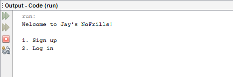

# Online Grocery Store

The following program is a grocery store coded in Java and designed to run in the terminal. Users can create and log into accounts, make purchases, and have their entire order history stored within a text file.

## Welcome Screen
The program will first open up, prompting the user to enter in whether they would want to log in or sign up. 
The user is prompted to enter a number:
  - If the user chooses 1 (Sign up);  the program will further ask them to enter in their name, email, username, password, and an answer to the security question. 
  - If the user chooses 2 (Login); the user will be prompted to enter their username and password, if their password is wrong then the user is given 3 tries to answer the security     question correctly, if not the program simply exits for safety purposes.
  

