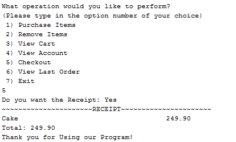

# Online Grocery Store

The following program is a grocery store coded in Java and designed to run in the terminal. Users can create and log into accounts, make purchases, and have their entire order history stored within a text file.

## Welcome Screen
The program will first open up, prompting the user to enter in whether they would want to log in or sign up. 
The user is prompted to enter a number:
  - If the user chooses 1 (Sign up);  the program will further ask them to enter in their name, email, username, password, and an answer to the security question. 
  - If the user chooses 2 (Login); the user will be prompted to enter their username and password, if their password is wrong then the user is given 3 tries to answer the security question correctly, if not the program simply exits for safety purposes.
  

## User Actions
After the user has opened their account, a menu of choices will be displayed. They choose how they sort the account and from there they are given options of what they would like to do. The user will be prompted to enter a number that corresponds with the action they want to perform:

### Sorting

### Options

### Add Items
  - If the choice is 1, the user is allowed the user to add to cart:
    - The user will be prompted to enter in the number of the item from the list and the quantity of said items, if the quantity is greater than the stock present a message is displayed and the user is prompted to enter again.

### Remove Items
If the choice is 2, the user is allowed to remove it from their cart:
  - The user will be prompted to enter what item number they would like to remove, the item will then be removed from their cart. 

### View Cart
If the choice is 3, the user is allowed to View Cart:
  - The items will be displayed for the user If the choice is 3.

### View Account
If the choice is 4, the account will be displayed for the user.

### Checkout
If the choice is 5, the user is allowed to Checkout:
  - The receipt is displayed and the total is calculated.
  - If the user asks for reciept, it is displayed and stored in their account text file.

### View Last Order
If the choice is 6, the user is allowed to View Last Order:
  - The user’s receipt text file is opened and the last order is displayed. 

### Exit
If the choice is 7, the user is allowed to exit the program.
